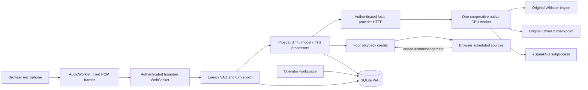

# Architecture

The workbench process owns session state, transport queues, VAD, Pipecat orchestration, playback credit and SQLite transactions. A separate provider process owns the model weights and one native worker. Neither the browser nor the workbench loads weights into JavaScript or sends audio to a paid service. Compose mounts original weights read-only on an internal provider network.

A session has a durable random identity, hashed session credential, connection generation and turn epoch. Reconnect increments both generation and epoch. Speech, explicit interruption, handoff and closure invalidate the previous turn. Every processor checks identity before and after awaiting a provider. SQLite updates require matching current identity and running state; terminal completion is single-use. Browser playback independently checks epoch and ordered sequence, and the server filters queued audio immediately before sending.

Pipecat0.0.25's actual `Pipeline` and custom `FrameProcessor` subclasses carry one `TurnFrame` containing the bounded utterance, context and stage outcomes. Direct sequential frame flow avoids building an unbounded input queue inside Pipecat's task abstraction. Start/end frames and cleanup still traverse the real pipeline. There is one active utterance task per session; interrupted tasks are cancelled and joined before another starts.

The provider's HTTP boundary validates base 64 PCM, exact request fields and bounded deadlines. A native worker slot remains reserved until its thread completes, including repeated cancellation of its caller. PyTorch stopping criteria check cancellation/deadline at generation steps; eSpeak is a separate subprocess that is killed and joined on cancellation. A blocking native operation may take longer than the requested deadline to return; the slot is never released early to hide that work. Qwen generates at most 48 tokens and Whisper at most 128 tokens. The browser receives synthesized chunks after the complete short response; this is turn-based speech synthesis, not token-to-audio streaming.

The Linux ARM profile uses the original Torch2.3 CPU wheel with its reference backend. The optimized oneDNN path exceeded a 4 GiB container during measured Qwen execution; disabling it avoids that observed memory behavior. Thread limits are applied inside the inference thread, since setting them only during startup did not sufficiently constrain the measured Linux HTTP worker. No checkpoint or model weights are changed.

SQLite uses WAL, `synchronous=FULL`, foreign keys and immediate transactions. An OS file lock permits one workbench process per database. On process restart, active turns become abandoned and recording is disabled. Events are flat, redacted and capped at 1000 per session; sessions, turns and tool receipts also have explicit limits. Raw microphone audio stays in bounded memory and is not stored in the database. References to known token/password/Bearer credential patterns are redacted before transcript persistence; this is not a guarantee that arbitrary spoken secrets are recognizable.

The operator key can list/review and accept pending handoffs. Workspace credentials can create calls; session credentials can access only their call. Keys are never placed in URLs. The first WebSocket message authenticates a call before any state is sent. Origin checks restrict browser requests to the serving origin, and the source API binds loopback by default. Remote use would require an explicit authenticated TLS deployment and operating policy beyond this local profile.
