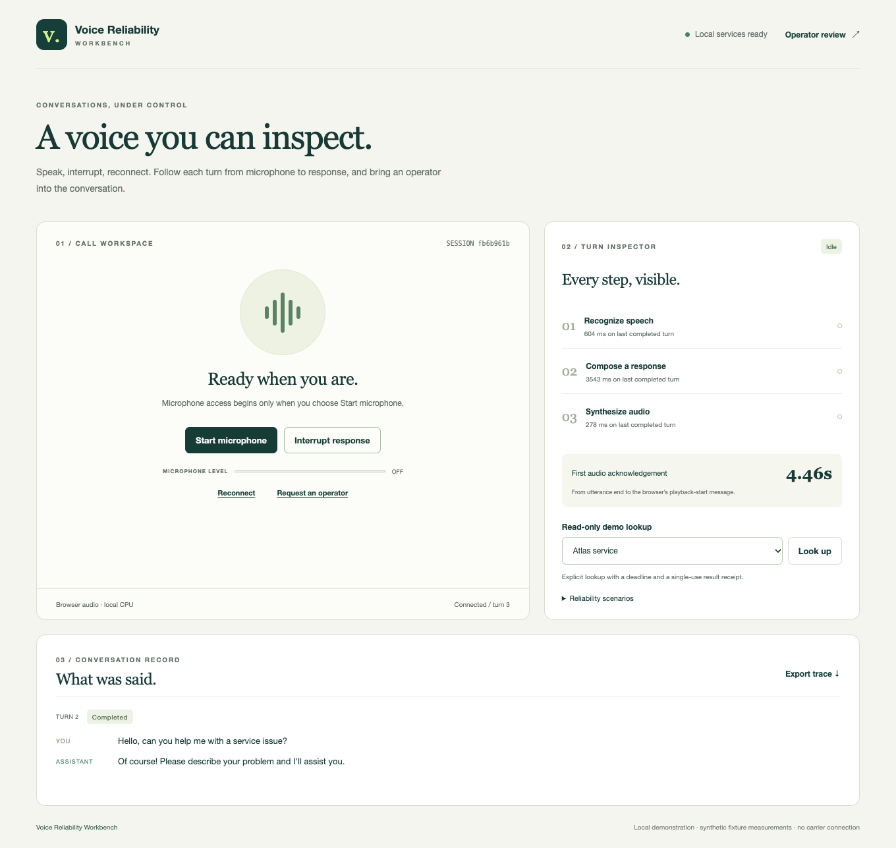
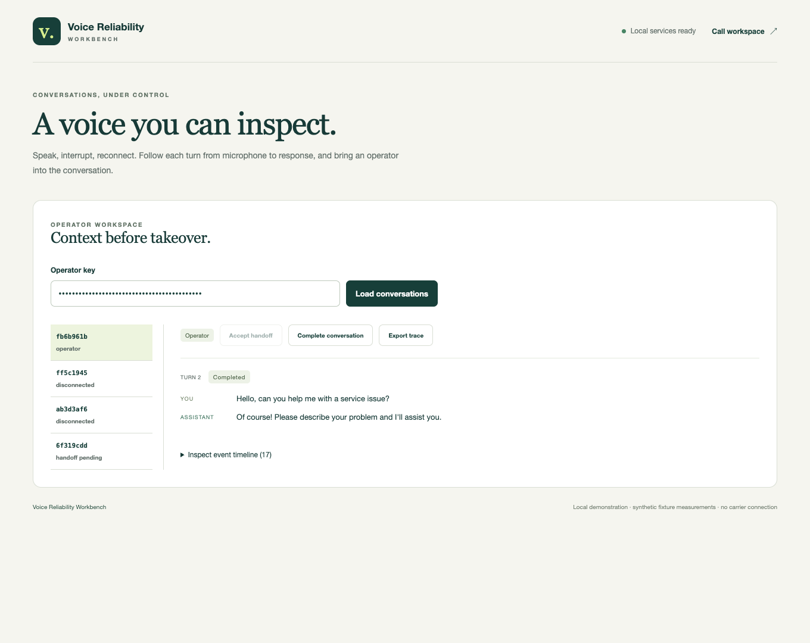

# Verification and measured limits

The measurements below use actual local CPU models and actual browser audio APIs. Controlled providers are used separately in regression tests to force races, failures and deadlines. Hosted CI, carrier calling and human audio accuracy are not inferred from either type of check.

## Speech fixture measurements

[Exact results](../evidence/fixture-measurements.json) retain all references, recognized text, replies, WER components, tokens and timing. The six project-owned fixtures were synthesized with original eSpeak NG1.51, resampled to mono 16 kHz PCM16 and include one disclosed noise variant. They are not recordings of human speech.

| Fixture | Word error rate | Observed limitation |
| --- | --- | --- |
| Greeting |0%| Short clean greeting recognized exactly |
| Atlas status |55.6%| Service name/request wording substantially changed |
| Atlas status with noise |44.4%| Incorrect phrase retained even though the proper name appeared |
| Human handoff |22.2%| “operator” became “heart forever” |
| Interrupt |0%| Short interruption phrase recognized exactly |
| Ticket number |70%| Recognition changed surrounding words and rendered spoken digits as numerals |

The corpus contains 52 reference words and 18 word errors: weighted WER34.6%. The evaluator lowercases and removes punctuation; it does not repair names or map number words to digits. The small Whisper model is unsuitable for asserting reliable names/numbers from this evidence. A correct short greeting does not establish general speech quality.

On Apple M3 Pro,11 logical CPUs,18 GiB RAM with a two-thread model worker, six warm sequential provider chains took1.07–3.09 seconds, median1.60 seconds. This includes STT, model and synthesis HTTP results, not browser playback duration. These are six observations under local host conditions, not a throughput or tail-latency benchmark. The [initial provider smoke](../evidence/provider-smoke.json) also retains a materially incorrect Atlas transcription and model reply.

## Browser journey

[Native browser records](../evidence/native-browser.json) preserve the full successful handoff, interrupted/reconnected turn and provider timeout. Chrome used its WAV-backed fake microphone device through real `getUserMedia`, AudioWorklet resampling, live framed audio, VAD, Pipecat, original Whisper/Qwen and eSpeak. Playback ran through real AudioContext sources and completion acknowledgements. No reference transcript was injected into the speech recognizer.

The completed warm greeting turn reported STT604 ms, model 3543 ms, synthesis 278 ms, first-audio acknowledgement 4462 ms and total completed playback 8211 ms. An earlier cold completed turn reported 7047 ms first audio. First-audio timing runs from server utterance completion to the browser's playback-start message. It includes network/message scheduling; it is not an acoustic measurement at a listener's ear.

The browser interruption test reaches actual synthesized playback, interrupts, observes durable cancellation, reconnects and verifies microphone consent is disabled. The trace records stop acknowledgement duration separately from model timing. The delayed-provider journey invokes the real HTTP worker with an injected delay and records `provider_timeout` without a late reply. The operator accepts the preserved transcript and closes the conversation through the real API.

## Durability and boundaries

[Process recovery evidence](../evidence/process-recovery.json) comes from a real isolated API subprocess killed during VAD speech. Restart preserved one abandoned turn, marked `process_restart`, required fresh consent and verified an online SQLite backup. This exercise did not load models. A separate real WebSocket regression sends200unpaced frames and observes 1013 input-overflow closure.

Regressions cover two-connection SQLite terminal-result races, stale epochs, repeated native-worker cancellation, distinct concurrent reconnect generations, tool duplicate/late-result rejection, redaction, bounded event retention, ordered playback credits, slow/closed listeners, origin rejection and separate operator/session credentials. Actual Pipecat classes participate in the pipeline tests.

The source includes independently audited exact model manifests, a41-package Python runtime and199-package frontend lock. Linux ARM has an additional hash-pinned wheel profile and original eSpeak source build. Container execution results are recorded separately from native measurements when verified. A compiled image alone does not establish an actual-model container result.

Energy VAD, synthetic-fixture WER, turn-based TTS, single-worker CPU capacity and local browser transport are deliberate evidence boundaries. No GPU/vLLM, telephone carrier, SIP, PSTN, production traffic or hosted-CI result is claimed.
